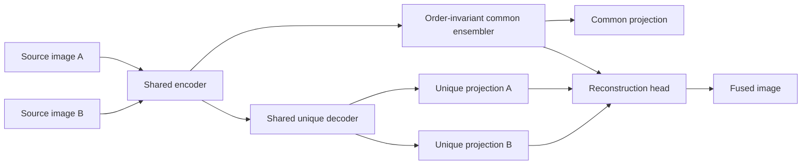

# A Label-Free Deep Learning Framework for Image Fusion Through Self-Supervised Feature Decomposition

[](https://github.com/AmalakantiSivaRamaSuryaNandh/label-free-deep-learning-image-fusion/actions/workflows/ci.yml)
[](https://www.python.org/)
[](https://pytorch.org/)
[](LICENSE)

An M.Tech project that combines two registered source images into one information-rich fused
image. The repository provides a compact self-supervised Common and Unique Decomposition (CUD)
network, five reproducible classical baselines, a Streamlit demonstration, command-line tools,
batch evaluation, automated tests, and research-reporting guidance.

> [!IMPORTANT]
> This is an independent educational implementation inspired by DeFusion, not the authors'
> official implementation. The repository does not claim reproduction of experimental figures
> until a named dataset, trained checkpoint, hardware configuration, and saved result artifacts
> are supplied.

## Project information

| Field | Details |
|---|---|
| Student | **Amalakanti Siva Rama Surya Nandh** |
| Programme | **M.Tech – Artificial Intelligence & Data Science** |
| Project guide | **Mr. AVV Satya Narayana** |
| Domain | Computer vision, deep learning, image fusion |
| Training approach | Label-free, self-supervised feature decomposition |

## Why this project

Multi-focus, multi-exposure, and infrared-visible sensors capture complementary information. A
useful fusion method should preserve shared scene content while retaining information unique to
each source. The project learns this decomposition without manually labelled fused targets by
constructing two mask-and-noise views from each clean training image.

## System architecture



During training, the network predicts common content, two unique components, and the reconstructed
clean scene. At inference, a trained checkpoint fuses a registered image pair without fine-tuning.
The common representation and final reconstruction are invariant to swapping source A and B.

## Key features

- Self-supervised mask-and-noise CUD target generation.
- Compact 2.53-million-parameter PyTorch model.
- Average, PCA, Laplacian-pyramid, wavelet, and local-focus baselines.
- Streamlit interface with input validation, transparent metrics, feature projections, and PNG
  download.
- CLI training and inference with saved configurations, histories, and checkpoints.
- Matched-folder evaluation for classical and trained CUD methods, including per-pair data, mean,
  standard deviation, runtime, environment metadata, and checkpoint SHA-256.
- Unit tests, coverage reporting, linting, formatting checks, and GitHub Actions CI.

## Repository structure

```text
.
├── .github/                    CI workflow and contribution templates
├── configs/                    Reproducible training configuration
├── docs/                       Methodology and evaluation guidance
├── scripts/                    Demo generation and batch evaluation
├── src/defusion_mtech/         Model, training, inference, metrics, and baselines
├── tests/                      Automated unit and smoke tests
├── app.py                      Streamlit demonstration
├── CITATION.cff                Software and source-paper citation metadata
├── REFERENCES.bib              Report bibliography entries
└── pyproject.toml              Package and tool configuration
```

## Installation

Python 3.10–3.13 is supported. Create an isolated environment and install the development package:

```bash
python -m venv .venv

# Windows PowerShell
.venv\Scripts\Activate.ps1

# Linux or macOS
source .venv/bin/activate

python -m pip install --upgrade pip
python -m pip install -e ".[dev]"
```

For CUDA, install the PyTorch build recommended for the local CUDA version before installing this
project.

## Run the application

```bash
streamlit run app.py
```

Classical methods work immediately. The CUD method requires a locally trained checkpoint; the
application will not silently fall back to random weights.

## Quick demonstration

```bash
python scripts/create_demo_pair.py
defusion-fuse --image-a examples/demo_pair/source_a.png --image-b examples/demo_pair/source_b.png --method laplacian --output runs/demo/fused.png --metrics-json runs/demo/metrics.json
```

## Train the CUD model

Prepare an unlabeled natural-image directory. The included configuration mirrors the broad ECCV
2022 training setup: 50,000 images, 256 × 256 crops, Adam, 50 epochs, batch size 8, learning rate
`1e-3`, and a factor-of-two reduction every ten epochs.

```bash
defusion-train --config configs/train_cud.json --data-dir data/coco/train2017
```

The output directory contains:

- `resolved_config.json` – exact resolved parameters;
- `history.jsonl` – per-epoch training losses and runtime;
- `latest.pt` and `final.pt` – model and optimizer checkpoints.

For a quick pipeline check:

```bash
defusion-train --data-dir path/to/images --output-dir runs/smoke --epochs 1 --batch-size 2 --crop-size 64 --base-channels 8 --max-images 8
```

## Deep-model inference

```bash
defusion-fuse --image-a path/to/source_a.png --image-b path/to/source_b.png --method cud --checkpoint runs/cud/final.pt --output runs/inference/fused.png --metrics-json runs/inference/metrics.json
```

Inputs must depict the same geometrically registered scene. Resizing or center-cropping only makes
dimensions match; it is not image registration.

## Reproducible evaluation

Put corresponding filenames in `source_a` and `source_b`, then evaluate baselines and a trained CUD
checkpoint together:

```bash
python scripts/evaluate_pairs.py --source-a data/evaluation/source_a --source-b data/evaluation/source_b --output-dir runs/evaluation --methods average pca laplacian wavelet local_focus cud --checkpoint runs/cud/final.pt --task multi-focus --dataset-name MFIFB --commit 0ce56f5
```

The evaluator saves fused PNGs, per-pair CSV metrics, and a JSON summary containing the pair count,
mean, standard deviation, runtime, environment, and checkpoint hash. Evaluate multi-focus,
multi-exposure, and infrared-visible datasets separately.

The included indicators are entropy, spatial frequency, mutual-information sum, and
`source_ssim_proxy`. The last value is average SSIM to the two inputs—not ground-truth SSIM. Add
accepted task-specific metrics such as MEF-SSIM, VIF, QAB/F, or SCD only with documented reference
implementations.

## Verification

```bash
ruff check .
ruff format --check .
pytest --cov=defusion_mtech --cov-report=term-missing
```

## Result integrity

No pretrained weights or research datasets are committed. Figures such as `SSIM = 0.831` or
`60 FPS` must not be presented as this implementation's results unless they are reproduced using a
frozen protocol and preserved evidence. Record the commit hash, checkpoint hash, dataset version,
pair list, preprocessing, seed, hardware, software versions, precision, and exact command.

## Documentation

- [Methodology](docs/methodology.md)
- [Evaluation protocol](docs/evaluation_protocol.md)
- [Corrections before final M.Tech submission](docs/report_corrections.md)
- [Contributing](CONTRIBUTING.md)
- [Security policy](SECURITY.md)

## Attribution

The CUD concept and DeFusion framework were introduced by Pengwei Liang, Junjun Jiang, Xianming
Liu, and Jiayi Ma in *Fusion from Decomposition: A Self-Supervised Decomposition Approach for
Image Fusion* (ECCV 2022). See the [paper](https://www.ecva.net/papers/eccv_2022/papers_ECCV/papers/136780706.pdf),
the [official implementation](https://github.com/erfect2020/DecompositionForFusion), and
[`REFERENCES.bib`](REFERENCES.bib).

## License

Project code is available under the [MIT License](LICENSE). Dataset and model-weight licenses remain
the responsibility of their respective owners.
